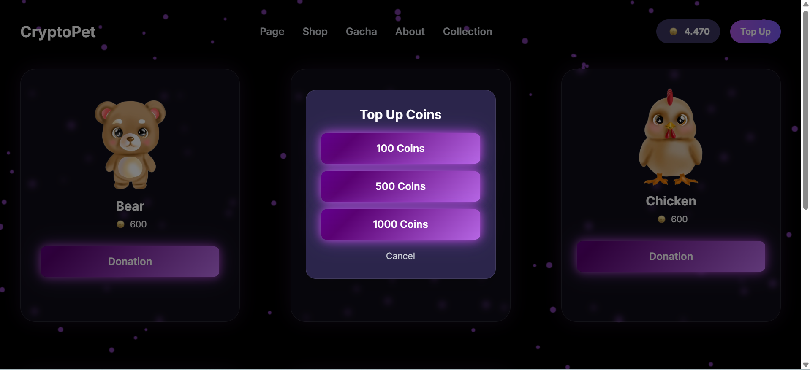
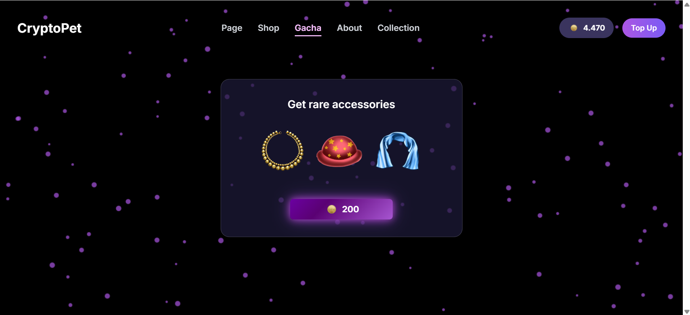
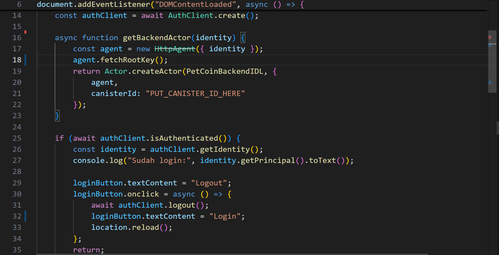

# `PetCoin`

Welcome to your new `PetCoin` project and to the Internet Computer development community. By default, creating a new project adds this README and some template files to your project directory. You can edit these template files to customize your project and include your own code to speed up the development cycle.

`PetCoin` is a platform designed to facilitate donations in a secure, transparent, and engaging way. Users can donate to people in need using Plug Wallet, sending ICP tokens directly to the recipient's address. The platform is fully integrated with Internet Identity (ICP login), ensuring that all transactions are traceable and transparent.

To make the donation experience more interactive, `PetCoin` provides collectible pet cards and accessories as rewards for donors. Each donation earns the donor a card or accessory, which can be collected, displayed, and even traded within the platform. Additionally, a gacha system is implemented to make collecting pets more fun: donors can spend PetCoins to perform a “gacha pull” and receive random pets or accessories. This gamification encourages users to engage more with the platform while supporting real causes.


To learn more before you start working with `PetCoin`, see the following documentation available online:

- [Quick Start](https://internetcomputer.org/docs/current/developer-docs/setup/deploy-locally)
- [SDK Developer Tools](https://internetcomputer.org/docs/current/developer-docs/setup/install)
- [Motoko Programming Language Guide](https://internetcomputer.org/docs/current/motoko/main/motoko)
- [Motoko Language Quick Reference](https://internetcomputer.org/docs/current/motoko/main/language-manual)

## Project structure

- `PetCoin-WCHL-Project/` — Root project directory
- `src/PetCoin_backend/` — Backend canister written in Motoko, handling PetCoin logic, donation tracking, and user data.
- `src/PetCoin_frontend/public/my-icp-login/` — Frontend using Vite + JS/HTML/CSS, handling wallet integration, ICP login, gacha UI, and collection display.
- `dfx.json` — DFX configuration file for canisters and local replica.

```bash
📂 src
 ┣ 📂 PetCoin_backend       → Motoko canister (business logic & token management)
 ┣ 📂 PetCoin_frontend
 ┃ ┣ 📂 public
 ┃ ┃ ┣ 📂 my-icp-login      → Internet Identity login system
 ┃ ┃ ┃ ┗ 📂 png             → Login icons & images
 ┃ ┗ 📂 src                 → React/JS frontend (App.jsx, components, integration logic)
 ┗ 📂 PetCoin_assets        → Logos, styles, extra images

```

## Running the project locally
To run this project, you must use Linux or WSL2 on Windows. The DFINITY SDK and Motoko canisters are optimized for Linux environments. Running on pure Windows or macOS may cause errors. If you want to start working on your project right away, you might want to try the following commands:

1. Installation and Setup
First, make sure you have the DFINITY SDK and Node.js installed.
If you don't have it, install the DFINITY SDK with this command:

```bash
sh -ci "$(curl -sS https://internetcomputer.org/install.sh)"
```

2. Cloning the Repository
Copy the project code to your local machine:

```bash
git clone https://github.com/lucy850/PETCOIN_WCHL_PROJECT1
```

3. Installing Dependencies

```bash
npm install
npm install @dfinity/agent@0.15.7 @dfinity/auth-client@0.15.7 @dfinity/candid@0.15.7 @dfinity/identity@0.15.7 --legacy-peer-deps
```

4. Running and Deploying

```bash
dfx start --background
```

After the replica starts in the new terminal, return to your original terminal to deploy your canisters:

```bash
dfx deploy
```

5. Generate Backend Declarations
Run only once to generate backend declarations

```bash
dfx generate PetCoin_backend
```

6. Running the Frontend

```bash
cd src/PetCoin_frontend/public/my-icp-login
npm run dev
```

7. Build frontend for production (output in dist/, use for hosting/deployment)

```bash
npm run build
```

8. Stopping the Replica

```bash
dfx stop
```

## Deployment to Mainnet
1. Create a Secure Identity
```bash
dfx identity new (your-secure-identity)
dfx identity use (your-secure-identity)
```
2. Check Cycles
Verify your identity has enough cycles to deploy canisters:
```bash
dfx ledger account-id
```
3. Deploy Canisters to Mainnet
```bash
dfx deploy --network ic

```


## Canister IDs

### Local Deployment
- PetCoin_frontend: `u6s2n-gx777-77774-qaaba-cai`
- PetCoin_backend: `uzt4z-lp777-77774-qaabq-cai`
- Internet Identity: `uxrrr-q7777-77774-qaaaq-cai`
  

## ICP Features Used
- Internet Identity (II) for secure, passwordless login
- Plug Wallet Integration for sending and receiving ICP tokens
- Custom Token (PetCoin) canister for rewarding users with donation credits
- On-chain Transparency: all donations and rewards are recorded on the Internet Computer
- Scalable Canisters: backend canister built in Motoko to manage donations, balances, and collectibles

## Challenges Faced
- Wallet Integration: Handling Plug Wallet connection and ICP balance validation before transactions
- Donation Tracking: Ensuring transparency while keeping data secure and private
- Frontend Responsiveness: Optimizing the UI for mobile devices while integrating multiple ICP features
- Canister Management: Keeping backend, frontend, and token canisters in sync during deployment
- Error Handling: Managing failed transactions, network issues, or wallet disconnections gracefully
- Gamification Design: Making the gacha system engaging while keeping it fair and balanced
- Scalability: Ensuring the backend canister can handle many users and donations simultaneously
- User Experience: Providing intuitive UI/UX for both new donors and returning users
- Testing & Debugging: Difficulty in testing canisters locally and ensuring accurate state across frontend and backend

## Target Solution
Many people want to donate to those in need, but traditional donation platforms often lack engagement or rewards, making the process less appealing.
PetCoin solves this by:
- Offering a secure and transparent donation system on the Internet Computer using ICP and Plug Wallet.
- Adding gamification: donors can collect unique virtual pets through a gacha system.
- Making donations fun, interactive, and rewarding, encouraging more frequent participation.

## How It Works
1. Default Flow
   If no custom wallet is set, the canister principal automatically receives all top-ups and donations.
2. Custom Flow
   You can set a platform wallet (any principal) to receive the main payments.
3. Revenue Flow
   - User Top-Up / Donation → goes to the Platform Wallet
   - Platform Wallet distributes the funds:
     - 95% → Donation to Pet / Creator
     - 5% → Kept as Platform Fee
    
 
## System Architecture Description

### Frontend Canister
- Built with Vite (HTML/JS).
- Handles Internet Identity login and Plug Wallet integration.
- Provides UI for donation, gacha, and pet collection.

### Backend Canister (Motoko)
- Manages core logic for donations, PetCoin balances, and collectibles.
- Stores transaction history for transparency.
- Interfaces with Plug Wallet for ICP token transfers.

### Token Canister (PetCoin Token / CPHW)
- Custom Motoko canister representing PetCoin credits.
- Rewards users when donating ICP.
- Supports balance query, mint, and transfer functions.

### External Services
- Internet Identity (II): Provides secure authentication.
- Plug Wallet: Facilitates ICP payments and balance checks.

### Future Plans
- Launch PetCoin on the ICP mainnet for real donations
- Show donation trends, transparency reports, and impact tracking
- Convert pets into tradeable NFTs on the ICP ecosystem
- Native mobile experience with Plug Wallet or other ICP wallets
- Allow PetCoin collectibles to be used in other ICP-based games and metaverses

### Data Flow
- User → Frontend Canister → Backend Canister → Token Canister → Plug Wallet → User


## Architecture Diagram

```bash
          ┌────────────────────────────┐
          │        Frontend            │
          │   (React/HTML/JS UI)       │
          │                            │
          │ 1. Login with ICP (II)     │
          │ 2. Connect Plug Wallet     │
          │ 3. Donate / Top-up PetCoin │
          └─────────────▲──────────────┘
                        │
                        │
      ┌─────────────────┼─────────────────┐
      │                 │                 │
      ▼                 ▼                 ▼
┌──────────────┐  ┌──────────────┐  ┌───────────────────┐
│ Internet      │  │ Plug Wallet  │  │ PetCoin Canister  │
│ Identity (II) │  │ (ICP Ledger) │  │ (Motoko Smart     │
│ Auth System   │  │              │  │  Contract)        │
└─────▲─────────┘  └──────▲──────┘  └───────────▲───────┘
      │ Principal ID       │ ICP Transfer       │ Verify & Store
      │                    │                    │
      ▼                    ▼                    ▼
 ┌───────────────────────────────────────────────────────┐
 │           Internet Computer Blockchain Network         │
 └───────────────────────────────────────────────────────┘

```

### Motoko
```bash
        +----------------+
        |  Internet      |
        |  Identity (II) |
        +--------+-------+
                 |
                 v
        +----------------+
        |  msg.caller    |   (Principal unik)
        +----------------+
                 |
     +-----------+------------+
     |                        |
     v                        v
+------------+        +--------------------+
| users map  |        | PetCoin Backend    |
| (username, |        | - topUps           |
|  bio)      |        | - donations        |
+------------+        +--------------------+

```


## User Flow


- User visits landing page
- Login via Internet Identity
- Connect Plug Wallet
- Select donation and approve ICP transaction
- Receive PetCoin rewards
- Use PetCoins to gacha or view collection
- Return to landing page or continue donation


## Features overview
- ICP Login: Secure login via Internet Identity, ensuring transparent donor authentication.
- Plug Wallet Integration: Users can top up, check balances, and donate using ICP tokens.
- Pet & Accessory Cards: Donors receive collectible cards representing pets and accessories as rewards for donations.
- Gacha System: Donors can spend PetCoins to perform gacha pulls and receive random pets or accessories, making donations more engaging.
- Collection Display: Users can view their acquired pets and accessories, with options to manage and showcase their collection.
- Responsive Frontend: Mobile and desktop friendly interface, with interactive elements like glowing buttons, particle effects, and modal popups.


## Functional Demo Video and Pitch Video
Watch the Demo of PetCoin in action: [Demo Video](https://youtu.be/4bsYGeVdy-k)
Watch the Pitch Deck of PetCoin in action: [Pitch Video](https://www.youtube.com/watch?v=22wb9m9vGqM)

## Screenshots

### 1. Landing Page
The main landing page of `PetCoin` showcases all key features in one view:  

- **Donation Section:** Users can send ICP and receive PetCoin rewards.  
- **Donation Recipient Workflow:** Recipients receive notifications and ICP balance updates, while donors can track the donation status.  
- **Blog / Information Section:** Displays platform updates, donation tips, and feature highlights.  


### 2. Pets Display
Shows the user's pet collection and acquired accessories. Users can view, manage, and showcase their collected pets as rewards from donations or gacha pulls.  


### 3. Top Up
Displays the top-up interface where users can add PetCoins using ICP. Shows balance input, approval, and confirmation.  



### 4. Gacha
Shows the gacha interface where users can spend PetCoins to get random pets or accessories.  




## Project Code

### Creates an AuthClient instance to handle Internet Identity login for the user.



This code is the core integration between the web frontend and the ICP canister backend, enabling secure login and subsequent user actions.

### INTERFACE LEDGER ICP

This snippet shows reading ICP balances from a ledger canister, which is a key blockchain integration feature.

### PETCOIN BACKEND CANISTER INTEGRATION

Shows frontend can interact fully with backend canister to manage pets, coins, and items

### FUNCTION TO CHECK ICP BALANCE

Demonstrates that can read the user’s ICP balance securely from the blockchain.

### CONNECT PLUG WALLET

Demonstrates that web app can authenticate users via Plug Wallet, a key blockchain integration feature.

### TOP-UP & SYNC BACKEND


Demonstrates secure blockchain transactions, wallet integration, and backend synchronization, which is a key feature of your project.

### MODAL & UI COIN

Ensures smooth and interactive user experience for viewing and topping up coins.

### WALLET BUTTON

- If the wallet is connected (plugConnected in sessionStorage), show “Top Up” and open the top-up modal.
- If not connected, show “Connect Wallet” and redirect to the connection page.

### SYNC BACKEND AFTER CONNECT

Ensures that frontend state reflects backend data, including coins and pet collection.

### BUY PET & SYNC BACKEND

Handles the purchase of a pet and synchronizes it with the backend.

`PetCoin` combines secure blockchain transactions with gamified interactions to make donating fun, transparent, and rewarding. It’s designed to motivate users to contribute to real causes while enjoying the collectible and interactive experience.


## License
This project is licensed under the MIT License - see the [LICENSE](LICENSE) file for details.

